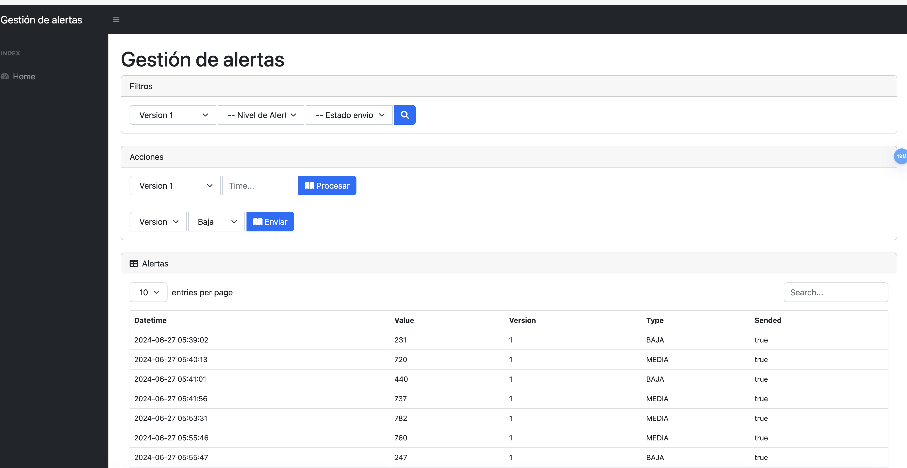

# Servicio-3

## Como correr el Servicio 3

Las APIs estan disponibles según lo descrito en la siguiente sección. 
Sin embargo es posible visualizar los eventos y ejecutar las 3 APIs (process / search / send) desde el front desarrollado para este fin.

La url del sitio es: http://localhost:8080/



## Descripción del problema

Este servicio expone una API con 3 endpoints los cuales harán diferentes
cosas de acuerdo a lo siguiente.

## POST challenge/process

Este endpoint va a procesar todos los mensajes que hayan llegado a **influx**, al bucket **system**, measurement **dispositivos**, que sean de cierta versión en el tiempo especificado. La versión puede ser 1 o 2 y el tiempo de busqueda es un string conteniendo un numero y una letra. Las letras posibles son *m, h, d* correspondientes a minutos, horas y días respectivamente, Ej: *15m, 3h, 2d*.
El procesamiento consiste en revisar los puntos e ir insertandolos en la tabla **alerts** del servicio **mysql** de acuerdo a lo siguiente:

- Si la versión es 1

  - Si el valor es mayor a 200 es una alerta de tipo BAJA
  - Si el valor es mayor a 500 es una alerta MEDIA
  - Si el valor es mayor a 800 es una alerta ALTA

- Si la versión es 2

  - Si el valor es menor a 200 es una alerta de tipo ALTA
  - Si el valor es menor a 500 es una alerta MEDIA
  - Si el valor es menor a 800 es una alerta BAJA

La tabla **alertas** debe tener las siguientes columnas:

- id_alerta: int,
- datetime: datetime,
- value: float,
- version: int,
- type: enumerate[BAJA, MEDIA, ALTA],
- sended: bool,
- created_at: datetime,
- updated_at: datetime

### Request

```json
{
    "version": number,
    "timeSearch": string
}
```

### Reponses

- 200 `{"status": "ok"}`
- 422 `{"status": "No se pudo procesar los párametros"}`
- 500 `{"status": "Error: {motivo}"}`

## POST challenge/search

Este endpoint busca y muestra todas las alertas de acuerdo a los filtros
solicitados.

En el caso de que se omitan uno o ambos opcionales se entiende que se deben mostrar todos.

### Request

```json
{
    "version": number,
    "type": string, // opcional
    "sended": bool // opcional
}
```

### Reponse

- 200
    ```json
    [
        {
            datetime: "2022-01-01 10:00:01",
            value: 566.45,
            version: 1,
            type: "MEDIA",
            sended: false
        }, ...
    ]
    ```
- 422 `{"status": "No se pudo procesar los párametros"}`
- 500 `{"status": "Error: {motivo}"}`

## POST challenge/send

Este endpoint busca y envía todas las alertas que no hayan sido
enviadas de acuerdo a los filtros solicitados.

Lo único que tiene que hacer para simular el envío es actualizar el campo **sended** de *false* a *true*

### Request

```json
{
    "version": number,
    "type": string
}
```

### Reponse

- 200 `{"status": "ok"}`
- 422 `{"status": "No se pudo procesar los párametros"}`
- 500 `{"status": "Error: {motivo}"}`